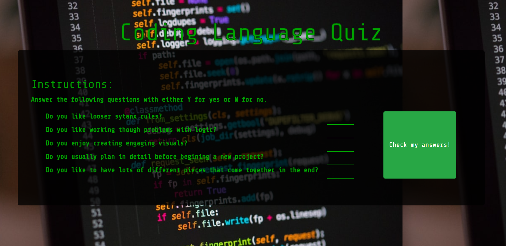

# Coding Language Quiz

## Usage
To try out this site click on the botton on the top  left that says clone or download, and into the console of your machine and enter:

    git clone https://github.com/NeverSettels/js-jquery-practice.git

then open the index.html file either drag and drop to the browser of open the file explorer and double click it.

## Description
A simple 5 question quiz te help you decide if you should learn CSS or javascript or learn both so you can learn React. It contains a simple error message in case of an invalid input.

## Technologies
### Languages
* HTML
* CSS
* JavaScript

### Libraries
* Bootstrp
* JQuery

### Extra Resources 
* Google fonts

## Licensing

MIT open licence 

